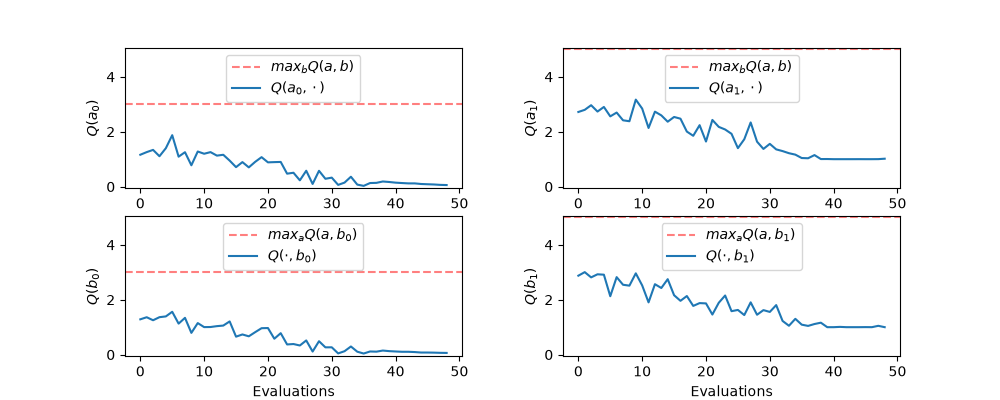

# Tabular MARL: Independent Q-Learning

A tabular implementation of **Independent Q-Learning (IQL)**, where two agents each learn their own Q-table from their own experience. The agents play a repeated **Prisoner's Dilemma**.

## Files

| File | Purpose |
|---|---|
| [`iql.py`](iql.py) | The `IQL` class: ε-greedy action selection, Q-learning updates and the ε schedule |
| [`matrix_game.py`](matrix_game.py) | `MatrixGame`, a two-player Gymnasium environment for a normal-form game, and `create_pd_game()` |
| [`train_iql.py`](train_iql.py) | Training loop, periodic evaluation and plotting |
| [`utils.py`](utils.py) | Plotting helpers for Q-tables, Q-value convergence and evaluation returns |
| [`figures/`](figures/) | Saved results |

## Algorithm

In independent learning, each agent $i$ treats every other agent as part of the environment. It learns its Q-values $Q_i(s, a_i)$ from its own observations, actions and rewards only. It never sees the other agents' actions.

For every agent, at each step $t$:

1. **Act ($\epsilon$-greedy):** with probability $\epsilon$, take a random action $a_i^t \in A_i$. Otherwise take

   $$a_i^t \in \arg\max_{a_i} Q_i(s^t, a_i)$$

   choosing uniformly at random among tied actions.

2. **Learn:** apply the Q-learning update

   $$Q_i(s^t, a_i^t) \leftarrow Q_i(s^t, a_i^t) + \alpha \left[ r_i^t + \gamma \max_{a_i'} Q_i(s^{t+1}, a_i') - Q_i(s^t, a_i^t) \right]$$

   When the episode has ended (`done`), the $\max_{a_i'} Q_i(s^{t+1}, a_i')$ term is set to $0$.

Q-tables are `defaultdict`s keyed by `str((obs, action))`, with every entry starting at $0$.

**Non-stationarity.** From agent $i$'s point of view, the other agents' policies $\pi_j$ are part of the environment. The transition function agent $i$ experiences is

$$T_i(s^{t+1} \mid s^t, a_i) \propto \sum_{a_{-i} \in A_{-i}} T\left(s^{t+1} \mid s^t, \langle a_i, a_{-i} \rangle\right) \prod_{j \neq i} \pi_j(a_j \mid s^t)$$

As the other agents learn, their $\pi_j$ change, so $T_i$ (and agent $i$'s expected rewards) change over time. The single-agent convergence guarantees of Q-learning therefore do not apply to IQL.

## Environment: Prisoner's Dilemma

Each episode is one step with a single dummy observation, so the game is stateless. Action 0 is **Cooperate (C)** and action 1 is **Defect (D)**. Each cell shows the rewards as (agent 1, agent 2):

|   | C | D |
|---|---|---|
| **C** | (3, 3) | (0, 5) |
| **D** | (5, 0) | (1, 1) |

Defecting pays more whatever the other agent does ($5 > 3$ and $1 > 0$), so **(D, D) is the only Nash equilibrium**. Both agents would still be better off if both cooperated.

## Configuration

| Parameter | Value |
|---|---|
| Episodes | 20,000 (1 step each) |
| Learning rate $\alpha$ | 0.05 |
| Discount $\gamma$ | 0.99 (unused here, because every episode ends after one step) |
| Training $\epsilon$ | Decays linearly from 1.0 to 0.01 over the first 80% of steps |
| Evaluation $\epsilon$ | 0.05 |
| Evaluation | 500 episodes, every 400 training episodes |
| Seed | 0 |

The training schedule, applied at step $t$ out of $T_{\max}$ total steps, is

$$\epsilon_t = 1 - 0.99 \cdot \min\left(1, \frac{t}{0.8 T_{\max}}\right)$$

## Results


*Figure 1: Mean evaluation return per agent (line) ± one standard deviation (shaded band) across 49 evaluations.*

Final Q-tables:

| Agent | $Q(C)$ | $Q(D)$ |
|---|---|---|
| 1 | 0.05 | 1.00 |
| 2 | 0.05 | 1.02 |

**Both agents learn to defect**, which is the Nash equilibrium.

- **Q-values.** $Q(D) \to 1$, the reward for defecting against a defector. $Q(C) \to 0$, the reward for cooperating against a defector. Each agent values its actions correctly *given the other agent's current policy*. $Q(C)$ is still slightly above $0$ because it was higher early in training, when the opponent still cooperated sometimes, and it is rarely updated once the agents act greedily.
- **The curve is flat from the first evaluation.** Defecting is better against *any* opponent, including a uniformly random one. So by the first evaluation (episode 400) each agent already has $Q(D) > Q(C)$, even though training $\epsilon$ is still about $0.98$.
- **The return settles near 1.07, not 1.0.** Evaluation still uses $\epsilon = 0.05$, so each agent defects with probability

  $$p = (1 - \epsilon) + \frac{\epsilon}{2} = 0.975$$

  The expected return is then

  $$\mathbb{E}[r] = p^2 \cdot 1 + p(1-p) \cdot 5 + (1-p)^2 \cdot 3 \approx 0.951 + 0.122 + 0.002 \approx 1.07$$

  with standard deviation $\sigma \approx 0.64$. This matches the observed 1.02–1.15 ± 0.46–0.82. The wide bands and the small differences between evaluations come from this exploration noise, not from instability in learning.

### Q-value convergence



*Figure 2: Q-values over the 49 evaluations. Top row: agent 1's $Q(a_0)$ (C) and $Q(a_1)$ (D). Bottom row: agent 2's $Q(b_0)$ (C) and $Q(b_1)$ (D). The red dashed line is the highest reward that action can earn against any opponent action (3 for C, 5 for D).*

Figure 1 barely moves, but the Q-values change a lot during training. This is the non-stationarity described above: each agent's Q-values follow the other agent's changing policy.

While the opponent explores with rate $\epsilon$, it defects with probability $1 - \epsilon/2$. Against that opponent, the expected reward of each action is

$$Q(C) = 3 \cdot \frac{\epsilon}{2} = 1.5 \epsilon \qquad Q(D) = 5 \cdot \frac{\epsilon}{2} + 1 \cdot \left(1 - \frac{\epsilon}{2}\right) = 1 + 2\epsilon$$

The curves follow these targets as $\epsilon$ decays:

| Stage | $\epsilon$ | Target $Q(C)$ | Target $Q(D)$ | Observed |
|---|---|---|---|---|
| Start (uniformly random opponent) | $\approx 1$ | 1.5 | 3.0 | $Q(C) \approx$ 1.2–1.5, $Q(D) \approx$ 2.7–3.0 |
| Evaluation 20 (episode 8,400) | $\approx 0.48$ | 0.72 | 1.96 | $Q(C) \approx$ 0.9–1.0, $Q(D) \approx$ 2.0 |
| From about evaluation 38 (episode ~15,600) | $0.01$ | 0.015 | 1.02 | $Q(C) \approx$ 0.05, $Q(D) \approx$ 1.0 |

- **$Q(D)$ stays above $Q(C)$ throughout**, since $1 + 2\epsilon > 1.5 \epsilon$ for every $\epsilon$. This is why the greedy policy, and so Figure 1, is "defect" from the first evaluation onwards.
- **$Q(D)$ levels off at 1** once $\epsilon$ reaches its minimum of $0.01$ at episode 16,000 (80% of training).
- **$Q(C)$ ends slightly above its target** (0.05 rather than 0.015). Once the agents act greedily, cooperation is only chosen during exploration, so $Q(C)$ gets few updates and lags behind.
- **The early curves are noisy** because $\alpha = 0.05$ is constant and the opponent's actions are close to random, so each update moves the estimate towards a very different reward (0, 1, 3 or 5).
- **No Q-value reaches the red line.** The red line is only reachable if the opponent always cooperates, which never happens here.

## Running

```bash
python -m venv .venv
.venv\Scripts\activate          # Windows
pip install -r requirements.txt
python train_iql.py
```

Training prints the evaluation returns and the final Q-tables, then shows the evaluation-return plot and the Q-value convergence plot.

> **Note:** `requirements.txt` asks for `numpy>=1.26.4` rather than pinning it exactly. NumPy 1.26.4 has no prebuilt wheels for Python 3.13 or newer.
