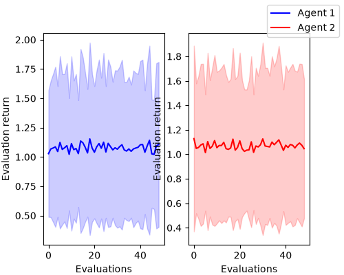

# Tabular MARL: Independent Q-Learning

A tabular implementation of **Independent Q-Learning (IQL)**, where two agents each learn their own Q-table from their own experience. The agents play a repeated **Prisoner's Dilemma**.

## Files

| File | Purpose |
|---|---|
| [`iql.py`](iql.py) | The `IQL` class: ε-greedy action selection, Q-learning updates and the ε schedule |
| [`matrix_game.py`](matrix_game.py) | `MatrixGame`, a two-player Gymnasium environment for a normal-form game, and `create_pd_game()` |
| [`train_iql.py`](train_iql.py) | Training loop, periodic evaluation and plotting |
| [`utils.py`](utils.py) | Plotting helpers for Q-tables, Q-value convergence and evaluation returns |
| [`figures/`](figures/) | Saved results |

## Algorithm

In independent learning, each agent *i* treats every other agent as part of the environment. It learns its Q-values `Q_i(s, a_i)` from its own observations, actions and rewards only. It never sees the other agents' actions.

For every agent, at each step:

1. **Act (ε-greedy):** with probability ε, take a random action. Otherwise take `argmax_a Q_i(s, a)`, choosing uniformly at random among tied actions.
2. **Learn:** apply the Q-learning update

   ```
   Q_i(s, a_i) ← Q_i(s, a_i) + α [ r_i + γ · max_a' Q_i(s', a') − Q_i(s, a_i) ]
   ```

   When the episode has ended (`done`), the `max_a' Q_i(s', a')` term is set to 0.

Q-tables are `defaultdict`s keyed by `str((obs, action))`, with every entry starting at 0.

**Non-stationarity.** From agent *i*'s point of view, the environment includes the other agents' policies π_j. Those policies change as the other agents learn, so the transitions and rewards that agent *i* experiences also change over time. The single-agent convergence guarantees of Q-learning therefore do not apply to IQL.

## Environment: Prisoner's Dilemma

Each episode is one step with a single dummy observation, so the game is stateless. Action 0 is **Cooperate (C)** and action 1 is **Defect (D)**. Each cell shows the rewards as (agent 1, agent 2):

|   | C | D |
|---|---|---|
| **C** | (3, 3) | (0, 5) |
| **D** | (5, 0) | (1, 1) |

Defecting pays more whatever the other agent does (5 > 3 and 1 > 0), so **(D, D) is the only Nash equilibrium**. Both agents would still be better off if both cooperated.

## Configuration

| Parameter | Value |
|---|---|
| Episodes | 20,000 (1 step each) |
| Learning rate α | 0.05 |
| Discount γ | 0.99 (unused here, because every episode ends after one step) |
| Training ε | Decays linearly from 1.0 to 0.01 over the first 80% of steps |
| Evaluation ε | 0.05 |
| Evaluation | 500 episodes, every 400 training episodes |
| Seed | 0 |

## Results



*Figure 1: Mean evaluation return per agent (line) ± one standard deviation (shaded band) across 49 evaluations.*

Final Q-tables:

| Agent | Q(C) | Q(D) |
|---|---|---|
| 1 | 0.05 | 1.00 |
| 2 | 0.05 | 1.02 |

**Both agents learn to defect**, which is the Nash equilibrium.

- **Q-values.** Q(D) → 1, the reward for defecting against a defector. Q(C) → 0, the reward for cooperating against a defector. Each agent values its actions correctly *given the other agent's current policy*. Q(C) is still slightly above 0 because it was higher early in training, when the opponent still cooperated sometimes, and it is rarely updated once the agents act greedily.
- **The curve is flat from the first evaluation.** Defecting is better against *any* opponent, including a uniformly random one. So by the first evaluation (episode 400) each agent already has Q(D) > Q(C), even though training ε is still about 0.98.
- **The return settles near 1.07, not 1.0.** Evaluation still uses ε = 0.05, so each agent defects with probability p = 0.95 + 0.05/2 = 0.975. The expected return is then

  ```
  E[r] = p²·1 + p(1−p)·5 + (1−p)²·3 ≈ 0.951 + 0.122 + 0.002 ≈ 1.07
  ```

  with standard deviation ≈ 0.64. This matches the observed 1.02–1.15 ± 0.46–0.82. The wide bands and the small differences between evaluations come from this exploration noise, not from instability in learning.

## Running

```bash
python -m venv .venv
.venv\Scripts\activate          # Windows
pip install -r requirements.txt
python train_iql.py
```

Training prints the evaluation returns and the final Q-tables, then shows the evaluation-return plot and the Q-value convergence plot.

> **Note:** `requirements.txt` asks for `numpy>=1.26.4` rather than pinning it exactly. NumPy 1.26.4 has no prebuilt wheels for Python 3.13 or newer.
